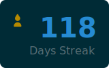

# GitHub Grass Streak




## INDEX

- [ABOUT](#about)
- [ENVIRONMENT](#environment)
- [PREPARING](#preparing)
- [HOW TO USE](#how-to-use)

---

## ABOUT

---

## ENVIRONMENT

```shell
deno -v
deno 2.6.3
```

---

## PREPARING

1. install deno using nix:

    ```shell
    nix develop
    ```

2. create a GitHub Personal Access Token with `repo` and `read:user` scopes.
3. add the following environment variables:

    ```shell
    export GH_USER="<YOUR_GITHUB_USERNAME>"
    export GH_TOKEN="<YOUR_GITHUB_TOKEN>"
    ```

4. run the script to check if it works:

    ```shell
    deno task start
    ls github-streak.svg
    ```

---

## HOW TO USE

---

## 使い方

1. このリポジトリをフォークします。
2. リポジトリの `Settings` > `Secrets and variables` > `Actions` に移動します。
3. `New repository secret` をクリックし、以下の名前でPersonal Access Token（`repo` と `read:user` スコープを持つ）を登録します:
    - `GH_TOKEN`
4. `.github/workflows/main.yml` に記載されている自分のGitHubユーザー名を確認・変更します。
5. Actionsを有効にし、`Create GitHub Streak SVG` ワークフローを手動で実行するか、次回のスケジュール実行（毎日 JST 9:00）を待ちます。
